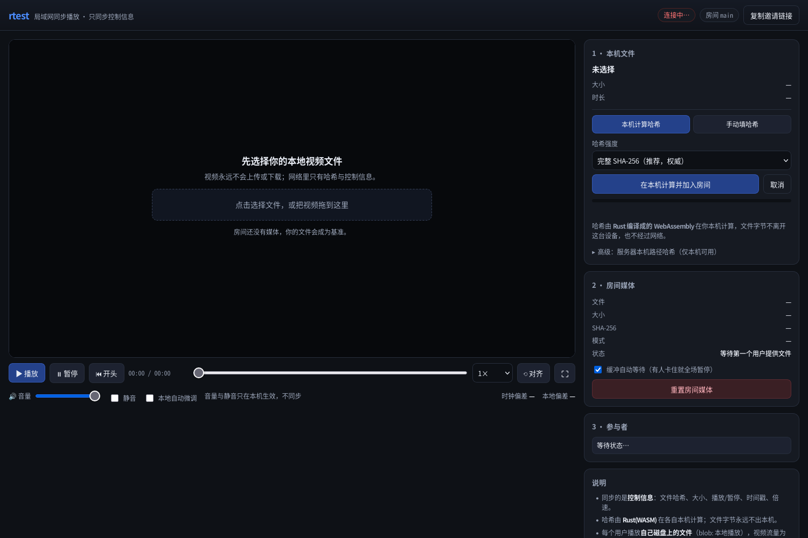

# rtest · 局域网同步播放器

Rust 写的同步播放工具：**单个可执行文件**启动一个网页服务，多个人在浏览器里各自打开自己的本地视频，
播放/暂停/跳转/倍速实时同步。

两条硬规则：

1. **视频字节一个字都不出本机**——既不上传，也不下载，也不转码；
2. **哈希由 Rust 在本机计算**——Rust 编译成 WebAssembly 跑在浏览器里，文件根本不需要离开这台设备。

网络上流动的只有控制信息：文件哈希、大小、时长、播放/暂停、基准时间戳、位置、倍速。

```bash
./scripts/build-wasm.sh        # 首次构建：编译浏览器内使用的 Rust 哈希器（约 18 KB）
cargo build --release          # 产物：target/release/rtest
./target/release/rtest         # 默认监听 0.0.0.0:8080
```

启动后终端会打印访问地址：

```
  房间:        main
  本机访问:    http://127.0.0.1:8080/?room=main
  局域网访问:  http://192.168.1.23:8080/?room=main
```

每个人打开该地址 → 选择自己磁盘上的同一个视频 → 点「在本机计算并加入房间」→ 开始同步播放。



## 需求对应的实现

| 需求 | 实现 |
| --- | --- |
| Rust 作后端 | `tokio` 手写 HTTP/1.1 + SSE 服务器，零 Web 框架 |
| 单可运行文件 | 前端 HTML/CSS/JS **和 wasm 哈希器**都用 `include_bytes!/include_str!` 编译进二进制 |
| 只同步控制信息 | 协议里只有：哈希、大小、时长、播放/暂停、基准时间戳、位置、倍速 |
| 音量不同步 | 音量与静音是纯本地状态，协议中**没有**这些字段 |
| 启动后网页访问 | 浏览器打开即用；整站资源（含 wasm）只在这台机器上提供 |
| 无须下载任何内容 | 每个用户播放自己磁盘上的文件（`blob:` URL），服务器不持有、不转发视频字节 |
| 选择本地视频文件 | 网页端文件选择/拖放；播放走 `URL.createObjectURL` |
| **用 Rust 计算哈希** | `src/sha256.rs`（纯 Rust 增量 SHA-256）编译成 `wasm32-unknown-unknown`，在浏览器里就地计算 |
| **绝不传输整个文件** | 服务端**只接受 ≤1 MiB 的 JSON 控制请求**，没有任何接收文件字节的接口；上传通道已被删除 |
| 确保多人用同一文件 | 房间以第一个用户的哈希为基准；哈希不一致返回 409 `hash_mismatch`，前端锁住播放并给出双方哈希 |

## 哈希怎么算

网页端的「本机计算哈希」用 `WebAssembly.instantiate` 加载内嵌的 Rust 哈希器，然后按 4 MiB 一批把文件
喂进 wasm 线性内存做增量 SHA-256。整段路径是：磁盘 → 浏览器 File API → wasm 内存 → 摘要，
**没有任何一步经过网络**。用浏览器 DevTools 的 Network 面板可以看到：勾选文件后网络请求数不会增加。

| 方式 | 读取量 | 适用 |
| --- | --- | --- |
| 本机完整 SHA-256（默认） | 整个文件（仅本地读盘） | 权威判定"同一个文件" |
| 本机抽样指纹 | 约 3 MB（头/尾/8 个采样点） | 几十 GB 的 remux，几秒出结果 |
| `rtest hash` 命令行 | 整个文件（仅本地读盘） | 不想开网页算，或想先算好再进房间 |
| 服务器本机路径 | 整个文件（服务器读自己的盘） | 视频就在服务器这台机器上，**仅回环地址可用** |

实测（本机 release 构建）：

| 项目 | 结果 |
| --- | --- |
| wasm 里跑 Rust SHA-256 | **213 MiB/s**（512 MiB 用 2.4 s） |
| `rtest hash`（CLI，纯 Rust） | **264 MiB/s**（1 GiB 用 4.1 s），与 `sha256sum` 逐位一致 |
| 抽样指纹 1 GiB | 12 ms |
| 网络传输量 | **0 字节**（无论文件多大） |

一条 1 GiB 的视频大约 5 秒算完，10 GB 的 remux 约 50 秒——瓶颈是本机磁盘读，不是网络。

## 同步是怎么做的

服务器为每个房间保存一份控制状态：

```json
{ "playing": true, "base_pos_ms": 60000, "base_srv_ms": 1757500000000, "rate": 1.0 }
```

任意时刻的位置 = `base_pos_ms + (现在 - base_srv_ms) × rate`，所有人以**服务器时钟**为基准。
客户端启动时用 4 次 `GET /api/hello` 取最小 RTT 样本来估算时钟偏差（精度约 ±RTT/2）。

**偏差不做持续修正**：客户端不会为了追平偏差去反复跳转、变速或发额外请求。
对齐只发生在收到**新的控制信息**的那一刻——有人播放/暂停/跳转/倍速，或缓冲等待触发了暂停/续播：

| 场景 | 处理 |
| --- | --- |
| 收到新控制信息，偏差 > 100 ms | 跳转到目标位置（只此一次） |
| 收到新控制信息，偏差 ≤ 100 ms | 不动 |
| 平时播放中 | 完全不动；偏差保留并显示在界面上 |
| 需要时 | 点「⟲ 对齐」手动拉平，或打开「本地自动微调」用变速慢慢磨 |

判断"是不是新控制信息"用的是状态签名（媒体哈希 + 播放态 + 基准位置 + 基准时间戳 + 倍速）：
服务器每秒发的心跳快照签名不变，客户端只刷新界面、绝不碰播放器。

另外有**缓冲自动等待**：某人卡缓冲超过 600 ms 会上报服务器，房间立刻暂停，等所有人就绪后自动续播
（90 秒仍未就绪就放弃等待，避免一个人卡死全场）。网页上可以关掉。

## 常用命令

```bash
./rtest                                  # 启动服务，默认 0.0.0.0:8080，房间 main
./rtest serve --port 9000 --room movie --open
./rtest hash /path/to/video.mkv          # 本地计算整文件 SHA-256
./rtest hash /path/to/video.mkv --sample # 抽样指纹（只读几 MB）
./rtest hash /path/to/video.mkv --json   # 输出一行 JSON，便于粘贴到网页
./rtest --help
```

## 验证

```bash
cargo test                        # 20 个单元测试：SHA-256 NIST 向量、状态机、采样计划、参数解析
node scripts/check-ui.mjs         # 前端 DOM 接线（id/class 是否存在、是否重复）
node scripts/check-wasm.mjs       # wasm 哈希器 vs Node crypto vs CLI（需要先构建主程序）
node scripts/check-sync-policy.mjs # 用 DOM 桩跑真实 app.js：验证"只在收到新控制信息时对齐"
bash scripts/smoke.sh             # 44 项端到端检查：真实起服务走完整流程
```

`scripts/check-wasm.mjs` 会直接实例化 wasm 并比对三份结果：Node 的 `crypto`、wasm 模块、`rtest hash` CLI，
整文件与抽样两种模式都比对——这正是"前后端算法不许漂移"的护栏。

`scripts/check-sync-policy.mjs` 用最小 DOM 桩加载真实的 `web/app.js`，断言：心跳快照不会引起任何
跳转/播放/暂停/变速；只有出现新的控制信息（暂停、倍速等）才允许调整。不是重写一份逻辑自测，而是跑交付文件本身。

`scripts/smoke.sh` 覆盖：静态资源、CLI 哈希与 `sha256sum` 一致、wasm 由服务端正确提供、**旧上传接口已返回 404**、
**>1 MiB 请求体被 413 拒绝**、房间媒体设定、哈希不一致被 409 拒绝、播放/跳转/倍速、缓冲等待、SSE 推送、
**空闲期间状态签名不变 / 操作后签名变化**、服务端路径哈希、重置房间，并在其中调用上面两个 Node 检查。

## 构建

```bash
# 1) 浏览器内的哈希器（只需在 wasm 源码变化后重跑）
rustup target add wasm32-unknown-unknown     # 一次性
bash scripts/build-wasm.sh                   # → web/rtest_hash.wasm（约 18 KB）

# 2) 主程序（会自动把上面的 wasm 内嵌进去）
cargo build --release
```

> 改了 `src/sha256.rs`、`src/hashspec.rs` 或 `wasm/src/lib.rs` 之后，**必须重跑 `scripts/build-wasm.sh`**，
> 否则内嵌的 wasm 会与主程序算法不一致。两道护栏会自动发现：前端有 ABI 版本校验，
> 冒烟测试里的 `check-wasm.mjs` 会直接比对两边摘要。

依赖只有 `tokio` / `serde` / `serde_json`，wasm 侧**零依赖**。无外网时：

```bash
cargo build --release --offline
cargo vendor vendor/       # 需要分发源码时把依赖打包进仓库
```

想做"拷到任何 Linux 都能跑"的完全静态文件：

```bash
rustup target add x86_64-unknown-linux-musl
cargo build --release --target x86_64-unknown-linux-musl
```

## 已知限制

- **浏览器解码能力**决定能播什么。MKV(H.265)/AC3 这类容器或编码多数浏览器不支持，建议 MP4(H.264+AAC) 或 WebM(VP9)。
  程序会在解码失败时提示，但不会帮你转码。
- 浏览器要求一次用户点击才允许自动播放；首次进入可能要按一下「点击开始播放」。
- 没有鉴权：同一局域网内知道房间号即可加入，**不要直接暴露到公网**。
- 房间状态保存在内存里，进程重启后清空；同一房间的媒体以第一个设定者为准。
- 抽样指纹模式无法发现未被采样区域里的差异，只适合"信任来源、只想防拿错文件"的场景。
- 同步精度受浏览器 `<video>` 定位粒度限制，实测同一局域网内通常在数十毫秒量级。

## 项目结构

```
src/main.rs           命令行、HTTP 路由、SSE、路径哈希接口
src/http.rs           极简 HTTP/1.1（解析、keep-alive、SSE 头、1 MiB 体积闸门）
src/rooms.rs          房间状态机与同步协议（位置/倍速/缓冲等待）
src/sha256.rs         纯 Rust 增量 SHA-256（含 NIST 测试向量）
src/hashspec.rs       采样计划与抽样摘要编码（主程序与 wasm 共用同一份源码）
wasm/                 浏览器内运行的 Rust 哈希器（cdylib → wasm32-unknown-unknown）
web/                  内嵌进二进制的网页前端 + 构建出的 rtest_hash.wasm
scripts/smoke.sh      端到端冒烟测试
scripts/check-wasm.mjs wasm 与 CLI 的哈希一致性校验
docs/DESIGN.md        设计文档（含协议与取舍）
```

更完整的设计说明、协议细节与取舍分析见 [docs/DESIGN.md](docs/DESIGN.md)。
